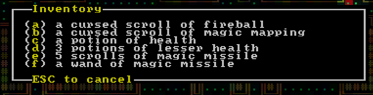

## a roguelike in rust, playable @ [llywelwyn.github.io](https://llywelwyn.github.io/)

#### using _rltk/bracket-lib_, and _specs_

this year for roguelikedev does the complete tutorial, i'm following along with thebracket's [_roguelike tutorial - in rust_](https://bfnightly.bracketproductions.com). for most of the 8 weeks, i'll probably just be working through the content rather than diverging too much into doing my own thing, since it's lengthy and i'd rather finish in time. that said, the ultimate aim here is to strip out the vast majority of the existing entities and replace them with my own, using the systems and components from the tutorial as a jumping-off point for something of my own making.

i'll try to remember to update the web version on my page at the end of every week

---

week 1

  
- brogue-like colours

-   i was staring at a horrible-looking game for a while as i tried to figure out how to make it look nice, before deciding to try the brogue method of colour offsets. when a map is generated, it also generates a red, green, and blue offset value for every tile on the map, and applies them during rendering. after making that change i started to miss the previous hue, so i combined the two. as it stands, every tile starts off a subtle green/blue, has rgb offsets applied on top of that, and then has the actual tile colour applied. and it ends up making something like this
    

-   fov

    -   decided to use bracket-lib's symmetric shadowcasting for common viewsheds (i.e. sight)
    -   and implemented elig's [raycasting](https://www.roguebasin.com/index.php/Eligloscode) algorithm for any viewsheds that _dont_ need that level of detail. symmetric is great, but when it comes to viewsheds that often _aren't_ symmetric in the first place, it's not really necessary (i.e. it's not often you've got two people with: the same additional viewshed, both within range, etc.). doing it this way comes with the benefit of being able to easily define what blocks a viewshed, rather than having to make a whole new BaseMap to work through bracket-lib

-   telepaths and having brains
    -   telepathy! a personal favourite rl feature, so i thought it'd be a cool test of the raycasting. right now it's simple, since the point was really just making sure the raycasting worked: there's a component for _being a telepath_, and for _having a mind_. if someone has telepathy, they'll see every entity with a mind within a given radius (defined by their telepath component), even through walls.
        
-   atomised spawn tables
    -   i tried figuring out how often things would spawn by just looking at the weighted tables, and i had no idea at a glance, so i replaced it with category tables. right now it's just rolling for an entity or a mob, and then rolling on the right table from there, but at least it means easily being able to see how often something will spawn. on average right now, there's 1 item : 3 mobs

---

  
week 2

  
- most of section 3 - generating maps
  - this week was mostly just working away at the mapgen stuff. getting all the algorithms in, chaining builders, being able to do prefabs. whenever i got bored i just opened rexpaint and toyed around with making simple vaults.
  
- 8-bit walls
  - i wasn't happy with how the walls looked, so i made the masks 8-bit instead of just 4-, which means being able to be a lot more specific with which glyphs are used. mainly it means no more grids of ╬. this comes with a side-effect of magic mapping looking a lot better.

    

---

  
week 3

  
- stacking items
  - finally, identical items in the inventory stack. i waited with this until figuring out a way that would work with extra parameters in the future like BUC. current solution is using a BTreeMap with a tuple containing the parameters that need to be the same (right now just the name) as the key, and the number of those items in the inventory as the value.

    

